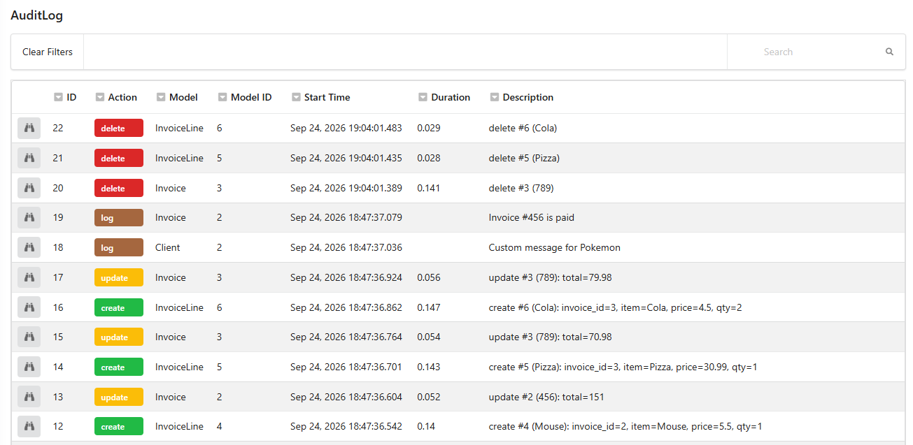
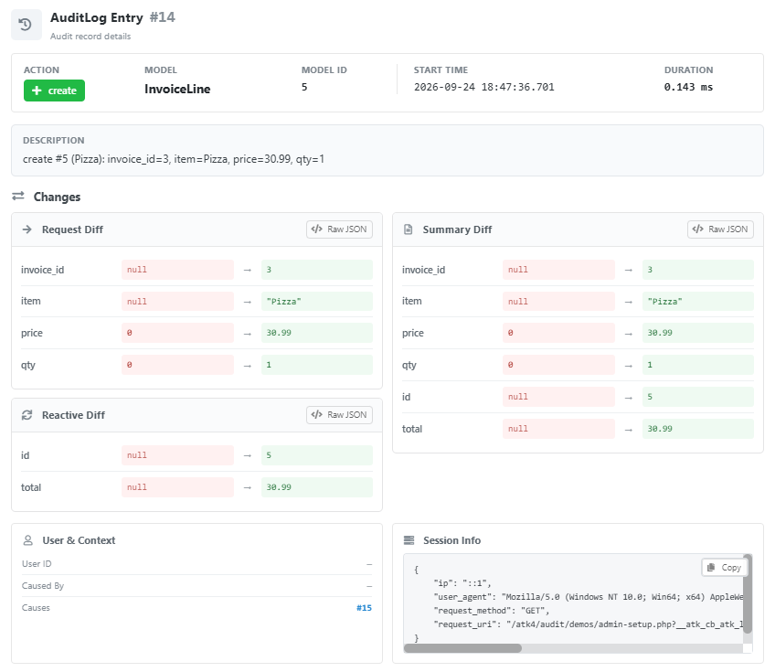

# Audit UI

Audit includes two ATK UI views:

* `Atk4\Audit\View\AuditGrid`
* `Atk4\Audit\View\AuditDetail`

`AuditGrid` is a normal ATK UI grid backed by `AuditLog`.

`AuditDetail` displays one loaded audit entity together with its requested and reactive changes and related audit actions.

## Audit grid

Display the complete audit log:

```php
use Atk4\Audit\Model\AuditLog;
use Atk4\Audit\View\AuditGrid;

$logs = new AuditLog($db);

AuditGrid::addTo($app)
    ->setModel($logs);
```

Because it is a grid, normal ATK UI grid functionality can be used with the audit model.

### Audit grid screenshot



## Audit history for one record

Every audited model receives an `AuditLog` reference.

For example:

```php
$user = (new \App\Model\User($db))->load($userId);

AuditGrid::addTo($app)
    ->setModel($user->ref('AuditLog'));
```

This shows only the audit history of that record.

## Audit details

Load one audit entry and pass the entity to `AuditDetail`:

```php
use Atk4\Audit\Model\AuditLog;
use Atk4\Audit\View\AuditDetail;

$log = (new AuditLog($db))->load($auditLogId);

AuditDetail::addTo($app)
    ->setEntity($log);
```

`AuditDetail` expects an entity, so use `setEntity()`, not `setModel()`.

The detail view shows information such as:

* action and description
* model and record ID
* user information
* requested changes
* reactive changes
* summary of changes
* the action that caused this entry
* actions caused by this entry
* request/session information

### Audit detail screenshot



## Typical audit page

A simple administration page can start with the global audit grid:

```php
$logs = new \Atk4\Audit\Model\AuditLog($db);

\Atk4\Audit\View\AuditGrid::addTo($app)
    ->setModel($logs);
```

Selecting an entry can then show that entity in `AuditDetail`.

The exact navigation and page layout are application-specific, but you can see nice working demo in demos folder.
